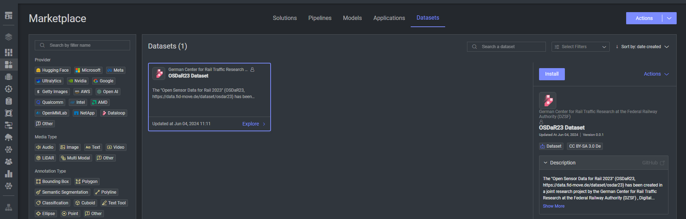

# Dataset adapter for OSDaR23 Dataset

This dataset adapter is designed to facilitate the transformation of the Lidar Open Sensor Data for Rail 2023 (OSDaR23) 
dataset from zip into a format compatible with Dataloop platform.\
The adapter simplifies the process of importing and preparing the dataset for various deep learning tasks.

## Installation

1. Navigate to **Startline**.
2. Select **Datasets**.
3. Click on **Install**. \
   
4. After a while, a new dataset will be created and visible under your **Data** section.